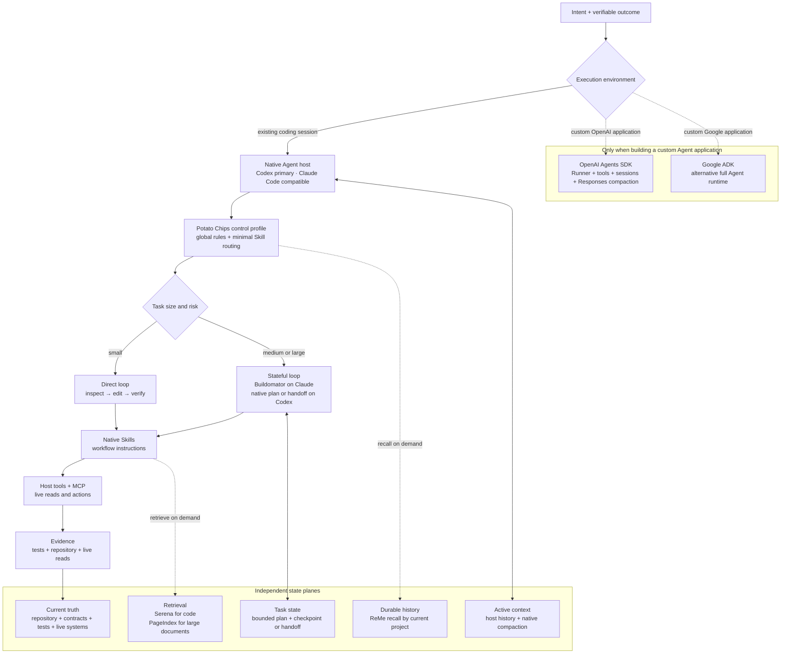

# Upper-layer architecture

Potato Chips is a control profile for existing coding-agent hosts. It selects
the smallest trustworthy workflow and connects independent capabilities without
creating a second runtime or capability registry.



## Layer contracts

| Layer | Owns | Must not become |
| --- | --- | --- |
| Native host | Model loop, tool execution, permissions, active context | A second copy of project truth |
| Potato Chips | First-principles routing and a small global Skill set | A runtime or shadow Skill registry |
| Skills | Reusable workflow instructions and optional scripts | Long-term memory or live system state |
| Task state | The next step, checkpoints, completion evidence, recovery | A transcript archive |
| Active context | What the current model turn needs | Durable history |
| ReMe | Searchable cross-session history scoped to the current project | Repository truth or raw transcript storage by default |
| Serena / PageIndex | On-demand retrieval from code or large documents | Another memory writer |
| Repository and live reads | Current facts and verification evidence | A summary inferred from old sessions |

## First-principles decisions

1. **Use the host that already exists.** Codex is the primary design and
   validation target. Claude Code remains a compatible host for shared Skills,
   rules, and MCP registration. Both already provide the Agent loop, context
   lifecycle, tools, permissions, and native Skill discovery. Adding an ADK
   above them duplicates ownership without improving the coding loop.
2. **Choose a runtime only for a custom Agent application.** OpenAI Agents SDK
   is the default OpenAI-native option; Google ADK is an alternative full
   runtime, not a component to stack underneath it.
3. **Keep the global Skill catalog small.** Codex progressively discloses Skill
   bodies, but the initial Skill metadata list has a bounded context budget.
   Project-specific behavior therefore stays in project Skills, and broad
   plugins remain optional.
4. **Escalate process only when state can be lost.** Small tasks execute
   directly. Medium or large, multi-step, migration, release, or cross-session
   work uses a bounded task-state layer. Buildomator is the Claude-specific
   implementation; it is not treated as a universal Codex Skill catalog.
5. **Compaction is not memory.** Native compaction preserves current-session
   continuity. ReMe stores curated durable history. Serena and PageIndex fetch
   source material. None of them overrides repository or live-system truth.
6. **Every capability has one owner and an exit path.** Install from the
   canonical source, verify it, update it there, and remove it when evidence no
   longer justifies the overlap.

## Catalog pressure

Progressive disclosure does not make an unlimited Skill catalog free. Codex
allocates a bounded part of its initial context to Skill names and descriptions;
large catalogs can have descriptions shortened or Skills omitted. Broad plugins
therefore remain opt-in, and their workflows are not copied into the global
Skill directory. When routing quality drops, remove overlap before adding a
second router.

## Runtime choice

| Situation | Recommended choice |
| --- | --- |
| Daily development in Codex or Claude Code | Use the native host plus Potato Chips |
| Long Claude task that needs resumable project state | Add Buildomator and use `/bm:` |
| Custom OpenAI-native Agent service | Use OpenAI Agents SDK; use Responses compaction for its session history |
| Custom Gemini or Google Cloud Agent service | Evaluate Google ADK as the alternative runtime |

OpenAI Agents SDK exposes `OpenAIResponsesCompactionSession`, which can compact
between turns and rewrite the stored session history. Google ADK provides its
own session compaction and separates short-term Session/State from searchable
long-term MemoryService. These are sound runtime designs, but neither belongs in
the default Codex/Claude installation path.

## Operational invariant

The evidence path is always:

```text
intent → route → retrieve only what is needed → change → verify → update task state
```

Durable memory is recalled on demand and corrected or deleted when stale. It is
never accepted as proof of current code, deployment, account, or market state.

## Primary sources

- [OpenAI: Build skills](https://developers.openai.com/codex/skills)
- [Open Agent Skills specification](https://agentskills.io/specification)
- [OpenAI Agents SDK: Sessions](https://openai.github.io/openai-agents-python/sessions/)
- [OpenAI Agents SDK: Models and compaction](https://openai.github.io/openai-agents-python/models/)
- [Google ADK: Context compaction](https://adk.dev/context/compaction/)
- [Google ADK: Session memory](https://adk.dev/sessions/memory/)
- [ReMe](https://github.com/agentscope-ai/ReMe)
- [Serena](https://github.com/oraios/serena)
- [Buildomator](https://github.com/buildomator/buildomator)
